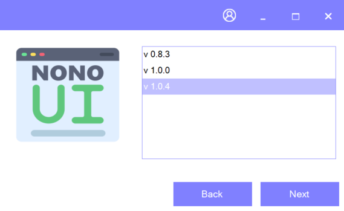

# NonoUI
NonoUI is a modern community driven Winforms UI library based on .Net 7

# Nuget
You can get the latest nuget package here: https://www.nuget.org/packages/NonoUI/

# Philosophy
I know Winforms is a pretty old technology, although it has been updated to the latest .Net version. I guess we all hate it, but also love it. Let's be honest: It has never been easier to quickly drag & drop together a small ui for a small tool.
And that's what we love about Winforms.

But Winforms applications doesn't look good, actually they look quite ugly.
There are a few Winforms gui libraries out there, some are quite expensive and some are closed source one man projects, that are also not free. There are 1 or 2 free gui libraries out there, but either for old .net framework or there are incomplete and buggy as hell.
I did not want to pay huge amounts of money for a Winforms gui library, but i did not want to rely on a one man (paid), closed source project either. So i looked around to see if there are other people like me who just wanted to have a way to design pretty Winforms applications quickly, and there where quite a few. So i started to work on NonoUI.

# Contribute
This is suppose to be a community driven modern Winforms UI library, so contributions are very welcome.
Just create a pull request with a detailed description about what your contribution is for.

I am happy about any contribution, may it be a small bug fix, a new small control or a big fully fledged control like an excel sheet editor (just an example).

> This is from the community for the community: so NonoUI uses the MIT licence, all code you contribute will also be under the MIT license, if you don't agree with that, please don't contribute.